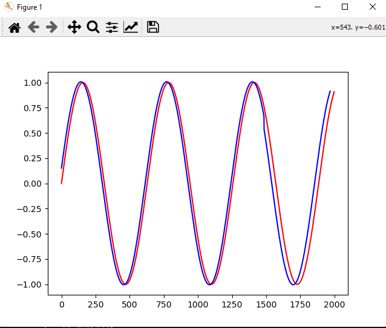
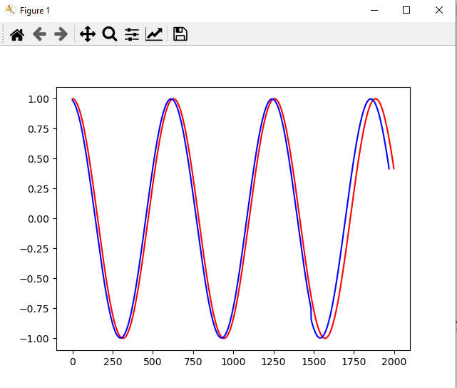

# simple-RNN-on-Trigonometric-circle

### **My model tries to learn Trigonometric functions.**
#### let's check the results...

<hr>

## Sine function :
<hr>

**last five epochs :**
```
Epoch 95/100
75/75 [==============================] - 0s 3ms/step - loss: 0.0024
Epoch 96/100
75/75 [==============================] - 0s 3ms/step - loss: 0.0018
Epoch 97/100
75/75 [==============================] - 0s 3ms/step - loss: 0.0013
Epoch 98/100
75/75 [==============================] - 0s 3ms/step - loss: 0.0017
Epoch 99/100
75/75 [==============================] - 0s 3ms/step - loss: 0.0021
Epoch 100/100
75/75 [==============================] - 0s 3ms/step - loss: 0.0020
16/16 [==============================] - 0s 2ms/step - loss: 0.0010

model.evaluate : 0.0010310098296031356
```
<hr>

**plot :**


<hr>

## Cosine function :

<hr>

**last five epochs :**
```
Epoch 95/100
75/75 [==============================] - 0s 3ms/step - loss: 0.0019
Epoch 96/100
75/75 [==============================] - 0s 3ms/step - loss: 0.0020
Epoch 97/100
75/75 [==============================] - 0s 3ms/step - loss: 0.0017
Epoch 98/100
75/75 [==============================] - 0s 3ms/step - loss: 0.0021
Epoch 99/100
75/75 [==============================] - 0s 3ms/step - loss: 0.0021
Epoch 100/100
75/75 [==============================] - 0s 3ms/step - loss: 0.0021
16/16 [==============================] - 0s 2ms/step - loss: 0.0020

model.evaluate : 0.0020051589235663414
```
<hr>

**plot :**
